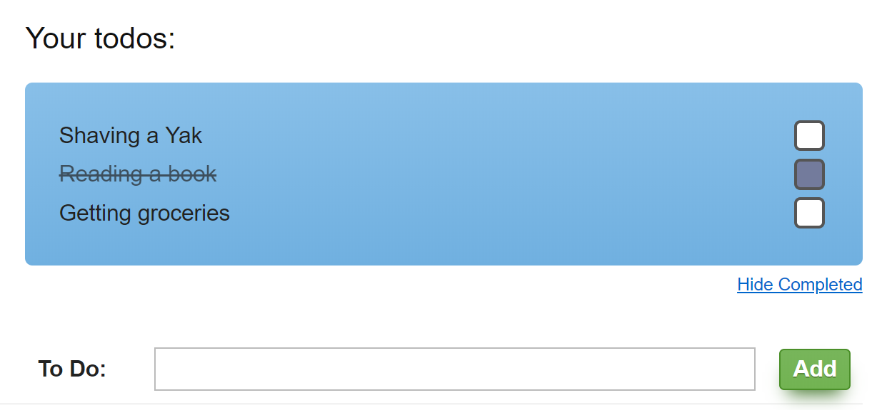

# Lift Todo

This is a simple Lift 3 todo application that
utilizes [idMemoize](https://lift.la/blog/shtmlidmemoize-simple-ajax-updating)
to perform ajaxy updates on its items.



The actions are triggered by Lift's `ajaxInvoke` and cause a re-render
of the previously memoized snippet. 
There's no client side Javascript involved. I know, crazy, right?

## Build

After cloning the repo, do a:

````bash
$ ./sbt
> ~jetty:start

````

Note: You may need to `chmod 755 sbt` to make it executable.

After downloading the interweb the site will be available at `http://localhost:8080`.

In the menu to the left there's a link "ToDo" that will show the todo page.

The Lift skeleton is bootstrapped via:

````bash
$ sbt new lift/basic-app.g8

````
It's using the [Lift basic template](https://github.com/lift/basic-app.g8).

Enjoy, disect, respond...
